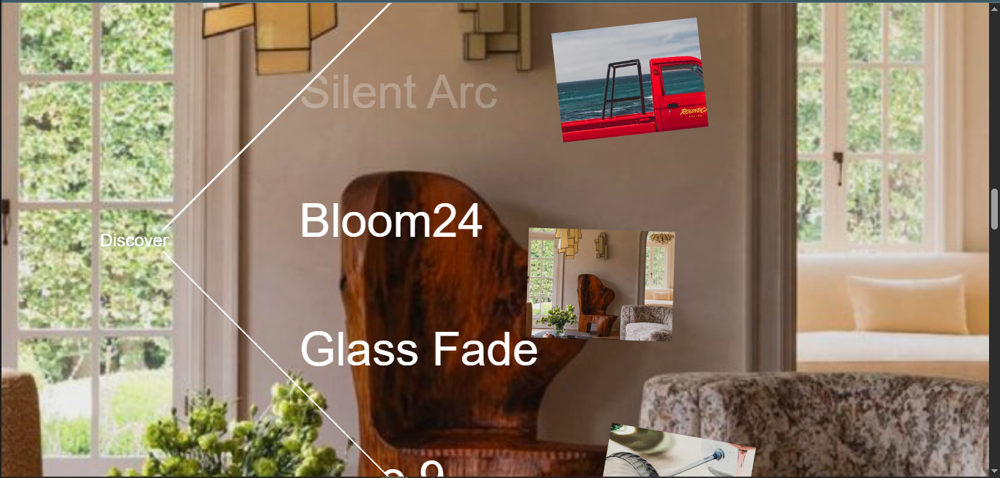
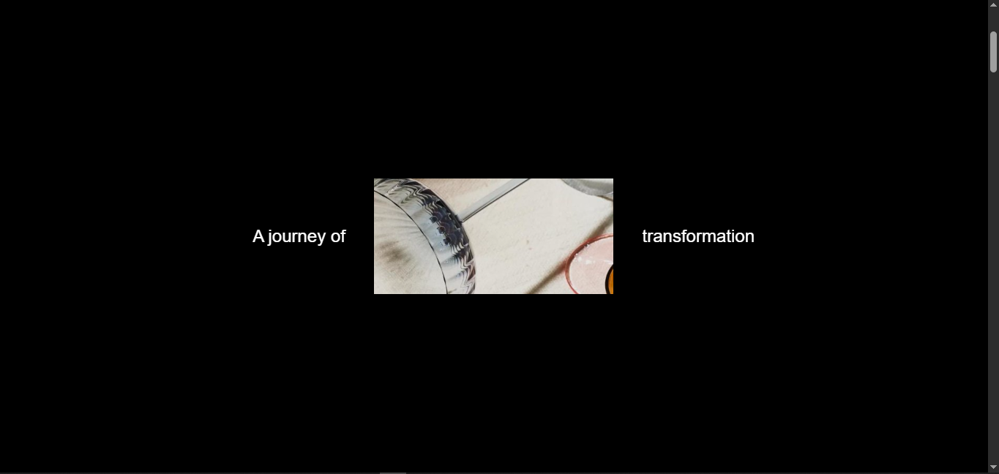

# 🌟 GSAP Scroll-Driven Spotlight Animation

A highly performant, cinematic scroll-driven storytelling experience built with **React**, **GSAP (ScrollTrigger)**, and **Lenis**. This project demonstrates advanced scroll orchestration, including dynamic bezier-path image flights, real-time index tracking, and seamless intro/outro loops.



## ✨ Key Features

- **Cinematic Multi-Phase Scroll**
  - **Intro:** Split-text reveal and background zoom to draw the user in.
  - **Spotlight Loop:** A continuous scroll phase where titles scroll vertically while corresponding images fly along a custom quadratic Bezier path on the right side of the screen.
  - **Outro:** A perfect loop effect where the animation gracefully reverses, scaling down the active image and bringing the intro text back together.

- **High-Performance Orchestration**
  - Integrates `gsap.ticker` with `Lenis` for frame-perfect momentum scrolling.
  - Employs an efficient "Closest to Center" detection algorithm to dynamically update active background and title opacities without DOM thrashing.
  - Leverages CSS `will-change` optimizations and hardware-accelerated transforms to maintain a strict 60FPS budget.

- **Dynamic Visual Design**
  - Implements a stark, editorial aesthetic with dynamic `clip-path` lens effects.
  - Features diagonal framing borders via CSS pseudo-elements seamlessly linked to JS variables.

## 📸 Preview



## 🛠️ Tech Stack

- **Framework:** [React 18](https://react.dev/) + [Vite](https://vitejs.dev/)
- **Animation:** [GSAP Core](https://gsap.com/) & [ScrollTrigger](https://gsap.com/docs/v3/Plugins/ScrollTrigger/)
- **Smooth Scrolling:** [Lenis](https://github.com/studio-freight/lenis)
- **Styling:** Vanilla CSS (Advanced properties) & Tailwind CSS

## 🚀 Getting Started

Follow these instructions to get a copy of the project up and running on your local machine.

### Prerequisites

Ensure you have Node.js (v16 or higher) installed.

### Installation

1. **Clone the repository**
   ```bash
   git clone https://github.com/hey-Zayn/GSAP-Scroll-Animation.git
   ```

2. **Navigate to the project directory**
   ```bash
   cd GSAP-Scroll-Animation
   ```

3. **Install dependencies**
   ```bash
   npm install
   ```

4. **Run the development server**
   ```bash
   npm run dev
   ```

5. **View the project**
   Navigate to `http://localhost:5173` in your browser to experience the animation.

## 💡 Architecture & Logic

- **`App.jsx`**: The command center for the ScrollTrigger orchestration. It handles the complex lifecycle phases (Intro, Spotlight, Outro), mathematically calculates the Bezier flight paths (`getBezierPosition`), and runs the real-time active index state logic.
- **`index.css`**: Provides the structural foundation and hooks necessary for the animation. It sets up the dynamic CSS variables (`--before-opacity`, etc.) that GSAP hooks into, ensuring the JavaScript and CSS stay perfectly synchronized.

## 🤝 Contributing

Contributions, issues, and feature requests are always welcome! Feel free to check the [issues page](https://github.com/hey-Zayn/GSAP-Scroll-Animation/issues) if you want to contribute.

## 📄 License

This project is open-source and available under the [MIT License](LICENSE).
